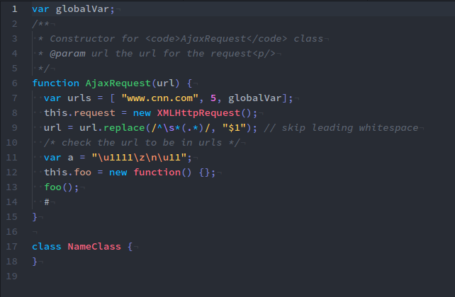
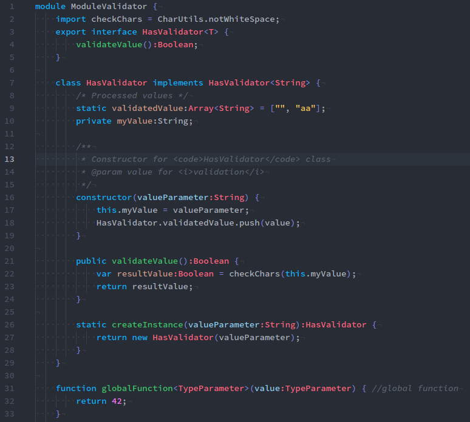
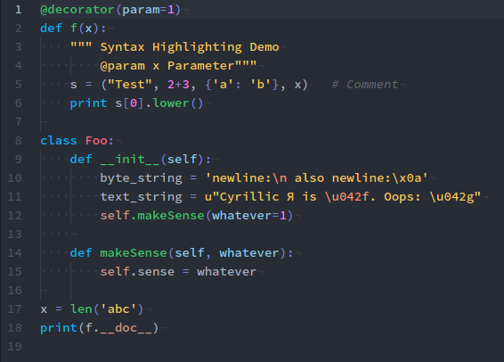
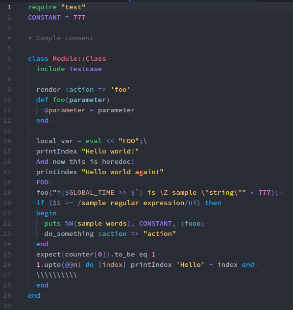
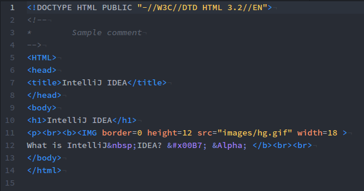
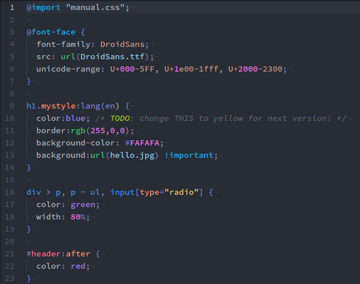

# bluloco-light-syntax theme

### Description
A fancy but yet sophisticated light designer color scheme for the Atom Editor.

Originally forked from the beatiful One Light Theme, enhanced with the meaningful intuitive bluloco color palette.

Give it a try :)

### Screenshots
Here are a bunch of screenshots.
I tested a long range of languages, these are just a few.

<!-- ###### Javascript

###### Typescript

###### Python

###### Python

###### HTML

###### CSS

-->

### Color Palette

  

keyword

  

string

  

number

  

operator

  

meta

  

method

  

constant

  

param

  

class

  

field

  

attribute

  

tag

  

template

  

fg

  

bg

